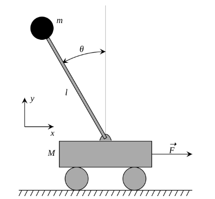

单级倒立摆系统的示意图和参数定义如图所示：

其中，小车质量为$M = m_c$，小球质量为$m = m_p$，杆长为$l$，杆与竖直方向的夹角为$\theta$（设逆时针方向为正），小车水平方向位移为$x$（向右为正），作用在小车上的力为$F = u$（向右为正），重力加速度设为$g$。

下面计算系统的动力学方程。作用在小车上的水平作用力$u$可以认为产生了小车和小球的共同加速度$\ddot{x}$以及小球相对于小车的水平方向的加速度，小球相对于小车的水平速度方向向左，其大小可以计算为
$$
v_p\cos\theta = \dot{\theta} l \cos\theta
$$

则小球相对于小车的水平加速度方向向左，大小为
$$
a_pc = \ddot{\theta}l\cos\theta - \dot{\theta}^2l\sin\theta
$$

因而对于系统整体应用牛顿第二定律，有
$$
(m_c + m_p)\ddot{x} - m_p(\ddot{\theta}l\cos\theta - \dot{\theta}^2l\sin\theta) = u
$$
对小球的力矩进行分析。如前所述，将小车对小球的作用力近似等价为水平方向的向左的作用力$m_p\ddot{x}$，则该作用力对小球产生一个垂直摆杆向左的力矩$m_p\ddot{x}l\cos\theta$；小球自身的重力也会产生一个垂直摆杆向左的力矩$m_pgl\sin\theta$。根据转动定律$M = I\alpha$，其中$M$是合外力矩，$I$是转动惯量，$\alpha$是角加速度，则有
$$
m_p\ddot{x}l\cos\theta + m_pgl\sin\theta = m_pl^2\ddot{\theta}
$$

将方程写为矩阵形式，如下所示：
$$
H\ddot{q} + C\dot{q} + G = Bu
$$

其中$q = [x,\ \theta]^T$，且
$$
\begin{align*}
    H &= 
    \begin{bmatrix}
        m_c+m_p & -m_pl\cos\theta \\
        -m_pl\cos\theta & m_pl^2 \\
    \end{bmatrix} \\
    C &= 
    \begin{bmatrix}
        0 & m_pl\dot{\theta}\sin\theta \\
        0 & 0 \\
    \end{bmatrix} \\
    G &= 
    \begin{bmatrix}
        0 \\
        -m_pgl\sin\theta \\
    \end{bmatrix} \\
    B &= 
    \begin{bmatrix}
        1 \\
        0 \\
    \end{bmatrix}
\end{align*}
$$

将上述动力学方程在零点附近展开，设$\cos\theta \sim 1,\ \sin\theta \sim \theta$，得到线性化后的系数矩阵：
$$
\begin{align*}
    H_l &= 
    \begin{bmatrix}
        m_c+m_p & -m_pl \\
        -m_pl & m_pl^2 \\
    \end{bmatrix} \\
    C_l &= 
    \begin{bmatrix}
        0 & 0 \\
        0 & 0 \\
    \end{bmatrix} \\
    G_l &= 
    \begin{bmatrix}
        0 \\
        -m_pgl\theta \\
    \end{bmatrix} \\
    B_l &= 
    \begin{bmatrix}
        1 \\
        0 \\
    \end{bmatrix}
\end{align*}
$$

设系统状态变量为$x = [x,\ \theta,\ \dot{x},\ \dot{\theta}]^T$，则线性化后的系统状态空间方程为
$$
\dot{x} = A_cx + B_cu
$$

其中各个矩阵为
$$
\begin{align*}
    A_c &= 
    \begin{bmatrix}
        0 & 0 & 1 & 0 \\
        0 & 0 & 0 & 1 \\
        0 & H^{-1}_{l12}m_pgl & 0 & 0 \\
        0 & H^{-1}_{l22}m_pgl & 0 & 0 \\
    \end{bmatrix} \\
    B_c &= 
    \begin{bmatrix}
        0 \\
        0 \\
        H^{-1}_{l11} \\
        H^{-1}_{l21}
    \end{bmatrix}
\end{align*}
$$

其中$H^{-1}_{lij}$表示矩阵$H^{-1}_{l}$的第i行第j列的元素，以此类推，矩阵$H^{-1}_{l}$可由如下计算公式得到：
$$
H^{-1}_{l} = \frac{1}{(m_c + m_p)m_pl^2 - m_p^2l^2}
    \begin{bmatrix}
        m_pl^2 & m_pl \\
        m_pl & m_c + m_p \\
    \end{bmatrix}
$$
